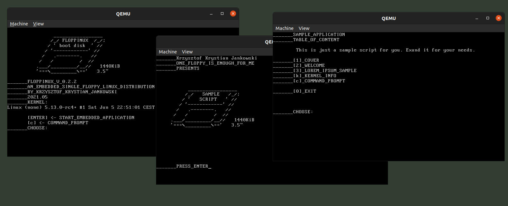

# FLOPPINUX 💾

An Embedded 🐧Linux on a Single 💾Floppy

Homepage: https://bits.p1x.in/floppinux/

## Article/Tutorial
- creating distribution on 32-bit systems: https://web.archive.org/web/20220513183037/https://bits.p1x.in/floppinux-an-embedded-linux-on-a-single-floppy/
- building on 64-bit systems: https://web.archive.org/web/20220520224018/https://bits.p1x.in/how-to-build-32-bit-floppinux-on-a-64-bit-os/
- creating custom application (script based) https://bits.p1x.in/creating-sample-application-on-floppinux/

## EPUB Manual
Read only the manual:

- This repo https://github.com/w84death/floppinux/tree/main/manual
- Mirror https://archive.org/details/floppinux-manual/

## UPDATE 0.2.2

Code refactored. Smaller builds. Instructions for 64-bit host OS.
Read more at: https://bits.p1x.in/floppinux-0-2-2/
